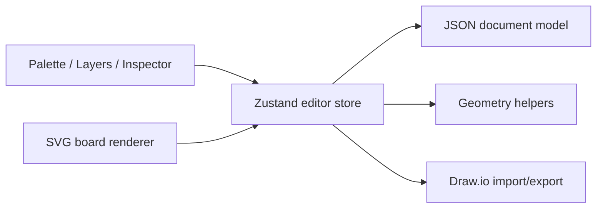

# Architecture

This document was generated with the assistance of Codex AI and prompted by Ustselemov.

## Core decisions

- Renderer: `SVG`
- Reason: nested transforms, clipping, DOM inspection, and Draw.io primitive mapping are simpler and more transparent than a canvas-first approach for this object count.
- State model: normalized JSON document with `nodes` map, `rootIds`, and separate `edges`.
- Runtime validation: `Zod` schemas at load/import boundaries.



## Data model

```ts
type EditorDocument = {
  id: string;
  name: string;
  version: string;
  idCounter: number;
  board: {
    zoom: number;
    panX: number;
    panY: number;
    gridSize: number;
    showGrid: boolean;
    snapToGrid: boolean;
    guides: boolean;
  };
  nodes: Record<string, EditorNode>;
  rootIds: string[];
  edges: Record<string, EditorEdge>;
  edgeIds: string[];
  meta: {
    source: "new" | "imported-drawio";
    originalFileName?: string;
    importedAt?: string;
    warnings: string[];
    unsupportedCount: number;
    unsupportedTokens: string[];
  };
};
```

## Main modules

- `src/lib/model`: persistent document types, schemas, defaults, tree operations
- `src/core/store`: Zustand store, history, clipboard, document actions
- `src/lib/geometry`: snapping, coordinate transforms, bounds checks, align/distribute helpers
- `src/lib/drawio`: Draw.io style parsing, XML import/export, validation
- `src/features/editor`: board renderer, node rendering, drag/resize interactions
- `src/features/palette`: palette drag sources
- `src/features/layers`: tree view, reparenting, lock/hide/order controls
- `src/features/inspector`: property editing, validation summary, and debug payloads

## Implemented MVP primitives

- Containers: `flowLane`, `screen`, `container`
- Leaf nodes: `field`, `segmentedControl`, `badge`, `banner`, `text`, `button`, `checkbox`
- Separate edge model: orthogonal connectors with `sourceId`, `targetId`, and optional points

## Project structure

```text
src/
  app/
  core/
  types/
  features/
    editor/
    inspector/
    palette/
    layers/
  lib/
    model/
    drawio/
    geometry/
```

## Import/export strategy

- Import: Draw.io XML -> parsed `mxCell` graph -> normalized document
- Export: document validation -> supported node mapping -> deterministic pretty XML
- Composite round-trip: `Field -> container + label text + value text`, `Checkbox -> box + label text`, `Screen -> container + external title text`
- Unsupported tokens are preserved in metadata and surfaced in the debug pane
