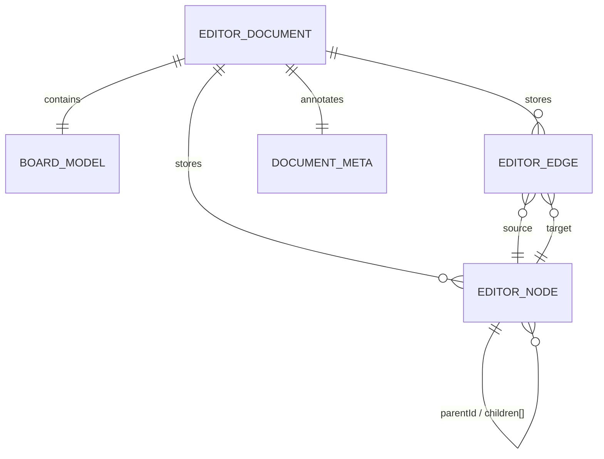

# Data Model

This project was generated with the assistance of Codex AI and prompted by Ustselemov.

## Overview

The editor is JSON-first. The runtime document is the canonical source of truth, and both the SVG renderer and Draw.io import/export map to the same normalized model.

## Core entities

- `EditorDocument`: top-level project object containing board state, nodes, edges, and document metadata
- `BoardModel`: zoom, pan, grid, snap, and guide flags
- `EditorNode`: discriminated union for screens, containers, lanes, content nodes, and unsupported imports
- `EditorEdge`: connector model stored separately from the node tree
- `DocumentMeta`: import source, warnings, and unsupported token tracking

## Key design rules

- node coordinates are stored relative to their parent
- hierarchy is explicit through `parentId` plus ordered `children[]`
- board roots live in `rootIds`
- connectors are not mixed into `children[]`; they are stored in `edges` and `edgeIds`
- layout is opt-in on container-like nodes via `layout.mode`

## ERD

## Related references

- [MVP3 Architecture](./architecture/mvp3-architecture.md)
- [MVP3 Current State Audit](./analysis/current-state-audit.md)
- [ERD Source](./diagrams/editor-model-erd.md)

