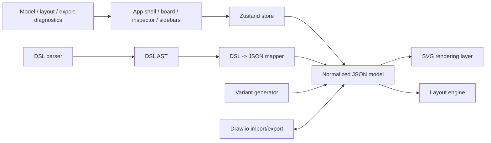

# MVP3 Architecture

This document was generated with the assistance of Codex AI and prompted by Ustselemov.

## Architecture summary

MVP3 extends the existing editor instead of replacing it:

- keep `React + TypeScript + Vite`
- keep `Zustand` for app state and history
- keep `Zod` for model validation
- keep SVG as the primary renderer
- keep Draw.io as an exchange format, not the primary state
- add DSL, variants, and layout as separate modules
- use the current `absolute / vstack / hstack` foundation as the first layout layer, then extend to `grid`

## Why SVG

SVG is the better choice here than Konva:

- easier DOM inspection for selection, handles, and tests
- simpler text rendering and overlay alignment
- easier import/export mapping for a document model
- lower implementation cost for an editor that is already XML/JSON centric

## Core layers

- `app`: shell, toolbar, sidebars, board layout
- `features/editor`: board interactions, selection, overlays, hotkeys
- `features/palette`: draggable component palette
- `features/layers`: tree, visibility, lock, ordering, reparent
- `features/inspector`: properties and diagnostics
- `lib/model`: document types, node factories, placement, validation
- `lib/geometry`: bounds, snapping, alignment, distribution
- `lib/layout`: layout config defaults and reflow engine
- `lib/drawio`: parsing, serialization, validation, warnings
- `lib/dsl`: parser, AST, mapping, diagnostics

## Data flow

1. User edits the JSON model through the store.
2. Renderer reads the model and draws the board.
3. Layout and validation update derived behavior.
4. DSL and Draw.io both map into the same typed model.
5. Exporters serialize from the model, not from rendered DOM.

## Design rules

- keep parent-child relationships explicit
- keep local coordinates relative to the parent
- keep generated screens manually editable
- keep unsupported import features visible as diagnostics
- do not use raw XML as primary state

## MVP3 delivery order

1. Stabilize the current editor core.
2. Extend the current layout foundation with `grid`, reordering semantics, and stronger constraints.
3. Expand the component catalog.
4. Implement DSL v1 and diagnostics.
5. Add variants and batch generation.
6. Expand template packs.
7. Harden Draw.io mapping and round-trip tests.
