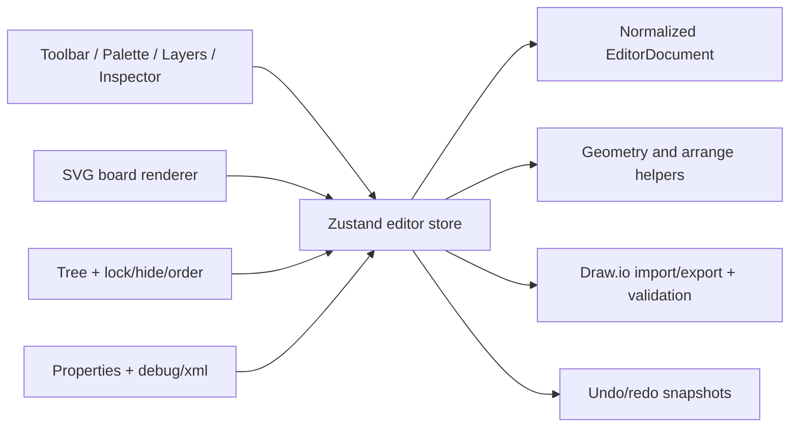

# MVP2 Architecture

This document was generated with the assistance of Codex AI and prompted by Ustselemov.

## Scope

This file reflects the implemented MVP2 baseline in the current repository.
The product remains JSON-first, uses SVG as the primary renderer, and treats Draw.io XML as an interoperability layer.

## Runtime structure

## Main architectural decisions

- Renderer: `SVG`
- Reason: nested transforms, clipping, inspection, and Draw.io cell mapping are simpler and more transparent than a canvas-first renderer for this node volume.
- State model: normalized `EditorDocument` with `nodes`, `rootIds`, separate `edges`, and `meta` diagnostics.
- Validation boundary: `Zod` validates JSON load/import shape; runtime validation reports logical issues like missing parents and invalid edge placement.
- Interaction model: board interactions commit through store actions, not by mutating Draw.io XML directly.

## Implemented editor behavior

- Infinite-style board with wheel zoom, right/middle mouse pan, space-drag pan, marquee selection, and fit actions.
- Strict parent-child hierarchy with local coordinates, clamp-to-parent, and automatic reparent to the deepest valid container.
- Multi-select, align/distribute, clipboard duplicate/paste, keyboard nudging, undo/redo.
- Layers tree with selection, reparenting, visibility toggle, lock toggle, and sibling order controls.
- Inspector with geometry, text/style editing, node state actions, validation summary, JSON/XML debug output, and unsupported token reporting.

## Data model summary

- Structural containers: `flowLane`, `screen`, `container`
- UI/content nodes: `field`, `segmentedControl`, `badge`, `banner`, `text`, `button`, `checkbox`
- Fallback node: `unsupported`
- Connector model: `edge`

## Draw.io strategy

- Import parses `mxCell` / `mxGeometry` into the internal JSON model.
- Export validates first, then serializes supported nodes and edges into minimal valid Draw.io XML.
- Unsupported styles and shapes are surfaced through `meta.warnings`, `meta.unsupportedTokens`, and `unsupported` nodes.

## Testing status

- Unit coverage exists for geometry, arrange helpers, parenting, store actions, Draw.io mapping, and round-trip.
- A basic repo-managed Playwright smoke test exists for board pan and nested parent-child movement, but the suite is still narrow.

## Remaining non-blocking limitations

- No minimap.
- No visual regression baseline artifacts yet.
- The supported mobile component catalog is intentionally narrower than the full aspirational MVP2 list.
- Production build now uses split chunks for XML tooling and no longer emits the earlier Vite size warning.
